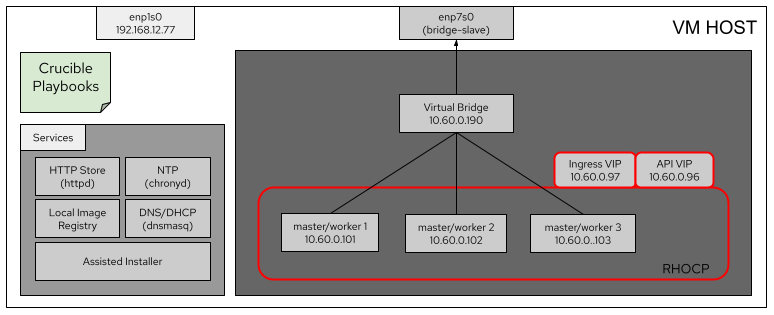

# How to deploy OpenShift on a VM using Crucible

## Scenario

The OpenShift cluster will be installed using virtual nodes within a VM with nested virtualization support. 

Assumptions:
- VM Host is running RHEL 8.5 and it is registered
- Your username has sudo permission
- All the services will be installed in the VM Host:
    -   HTTP Store
    -   NTP Server
    -   Local Image Registry
    -   DNS/DHCP
    -   Assisted Installer
- Crucible version
    -   Commit: f32b46317e5bb25fffe16c93fdc0f87a72d423bf



## Steps

### Check VM network configuration

You will need two network interfaces. The first one (enp1s0 in the diagram) must have access to the Internet. The second one (enp7s0 in
the diagram) does not need an IP address, just needs to be up.

### Install Ansible

Install the EPEL repository

> $ sudo subscription-manager repos --enable "codeready-builder-for-rhel-8-$(arch)-rpms"
>
> $ sudo yum -y install <https://dl.fedoraproject.org/pub/epel/epel-release-latest-8.noarch.rpm>


Install Ansible

> $ sudo yum install ansible


### Enable sudo for your user without password

Create the crucible group

> $ sudo groupadd crucible

Add your username to the crucible group

> $ sudo usermod -aG crucible *username*

Edit the /etc/sudoers file to make the crucible group passwordless

> $ sudo vim /etc/sudoers

```
%crucible ALL=(ALL) NOPASSWD: ALL 
```

### Create the crucible user and add it to the wheel group

> $ sudo useradd crucible
> 
> $ sudo passwd crucible (set the password)
> 
> $ sudo usermod -aG wheel crucible

### Install git package

> $ sudo dnf install git

### Check python version

Python version must be 3.6.8 or higher

> $ python3 --version

### Install other dependencies

> $ sudo dnf install python3-netaddr skopeo podman

### Install openshift-clients

Attach an OpenShift subscription (as detailed in [Getting started with the OpenShift CLI - OpenShift CLI (oc) \| CLI tools \| OpenShift
Container Platform 4.9](https://docs.openshift.com/container-platform/4.9/cli_reference/openshift_cli/getting-started-cli.html#cli-installing-cli-rpm_cli-developer-commands)

> $ sudo subscription-manager list --available --matches '\*OpenShift\*'
>
> $ sudo subscription-manager attach --pool=<pool_id>
>
> $ sudo subscription-manager repos --enable="rhocp-4.9-for-rhel-8-x86_64-rpms"
>
> $ sudo dnf install openshift-clients

### Update RHEL

If you are using RHEL 8.4 please update it, otherwise you may encounter problems with outdated packages.
> $ sudo dnf -y update

### Edit /etc/libvirt/qemu.conf

> $ sudo vim /etc/libvirt/qemu.conf

```
# The user for QEMU processes run by the system instance. It can be
# specified as a user name or as a user id. The qemu driver will try to
# parse this value first as a name and then, if the name doesn't exist,
# as a user id.
#
# Since a sequence of digits is a valid user name, a leading plus sign can be used to ensure that a user id will not be interpreted as a user
# name.
#
# Some examples of valid values are:
#
# user = "qemu" # A user named "qemu"
# user = "+0" # Super user (uid=0)
# user = "100" # A user named "100" or a user with uid=100
#

user = "<your_username>"

# The group for QEMU processes run by the system instance. It can be
# specified in a similar way to user.

group = "<group>"
```

### Update the firewall policies

> $ sudo firewall-cmd --zone=public --add-masquerade --permanent
>
> $ sudo systemctl restart firewalld

### Clone repository into ~/crucible

> $ cd ~
> 
> $ git clone <https://github.com/redhat-partner-solutions/crucible.git>

### Edit your inventory file

> $ cp ~/crucible/inventory.yml.sample ~/crucible/inventory.yml
>
> $ vim ~/crucible/inventory.yml

You can find the inventory file of this scenario in: [inventory.yml](https://github.com/Demostenes777/crucible/blob/slcm-tests/inventory.yml)

### Download the pull secret

Please [download](https://console.redhat.com/openshift/install/metal/installer-provisioned)
the pull secret and place it at ~/crucible/pull-secret.txt

> $ mv ~/Downloads/pull-secret ~/crucible/pull-secret.txt

### Install Ansible requirements

> $ ansible-galaxy collection install -r ~/crucible/requirements.yml

### Add your sensitive information to the vault file

> $ cp ~/crucible/inventory.vault.yml.sample ~/crucible/inventory.vault.yml

Update the vault file with the following information:

> $ vim inventory.vault.yml

```
VAULT_NODES_BMC_USER: <root_user>
VAULT_NODES_BMC_PASSWORD: <root_password>
VAULT_REGISTRY_HOST_REGISTRY_HTTP_SECRET: <choose_registry_pass>
VAULT_REGISTRY_HOST_DISCONNECTED_REGISTRY_USER: crucible
VAULT_REGISTRY_HOST_DISCONNECTED_REGISTRY_PASSWORD: <crucible_password>
```

### Encrypt the vault file

> $ ansible-vault encrypt ~/crucible/inventory.vault.yml

### Fix DNS requirements specific to this use case

`This should be removed once it is tested the new inventory

Edit ~/crucible/roles/insert_dns_records/defaults/main.yml

We need to ensure that the listen_address is set to the virtual bridge IP address, which in the
diagram is 10.60.0.190

```
listen_address: <your_virtual_bridge_ip>
```

Edit ~/crucible/roles/insert_dns_records/templates/openshift-cluster.conf.j2 and ensure that the listen-address is set to the virtual bridge IP address

```
listen-address=127.0.0.1,<your_virtual_bridge_ip>
```

### Run pre-deployment validation playbooks

> $ cd ~/crucible ansible-playbook -i inventory.yml prereq_facts_check.yml -e "@inventory.vault.yml" --ask-vault-pass
>
> $ ansible-playbook -i inventory.yml playbooks/validate_inventory.yml -e "@inventory.vault.yml" --ask-vault-pass

### Run the site.yml playbook to create the OpenShift cluster

> $ cd ~/crucible
>
> $ ansible-playbook -i inventory.yml site.yml -e "@inventory.vault.yml" --ask-vault-pass
